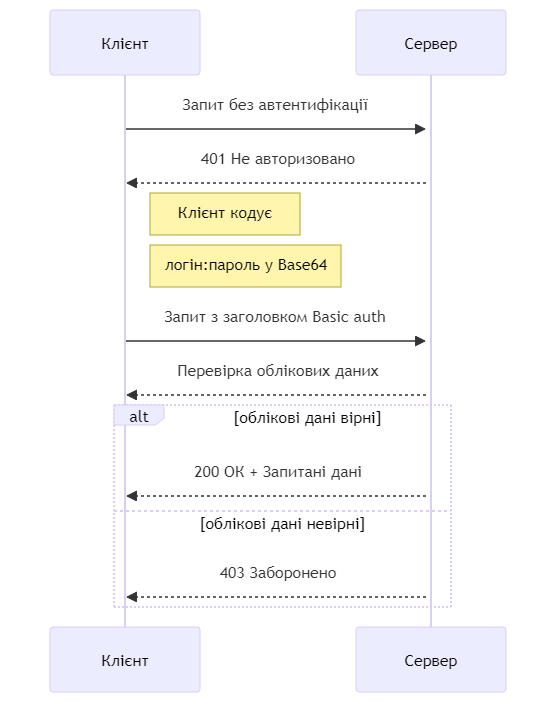

# Bachelor HTTP Basic Auth
Repository contains code of HTTP Basic Authentication for my Dyplom Bakalavra (Diploma/ qualification of Bachelor)

|             | Information                   | 
| --------    | --------                      |
| Name        | The Basic HTTP Authentication |
| Standard    | RFC 7617                      |
| Description | The "Basic" Hypertext Transfer Protocol (HTTP) authentication scheme, which transmits credentials as user-id/password pairs, encoded using Base64.     |

#### Diagram:
